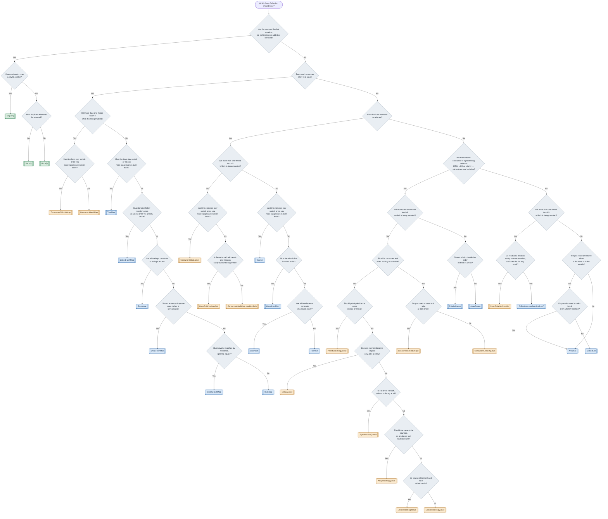

# Java

## Collections

How to choose from `Collection` types:

```mermaid
flowchart TD
    START(["Which Java Collection should I use?"]) --> IMMUT{"Are the contents fixed at creation,<br/>so nothing is ever added or removed?"}

    IMMUT -->|Yes| IMM_KV{"Does each entry map<br/>a key to a value?"}
    IMM_KV -->|Yes| R_MAPOF[["Map.of()"]]
    IMM_KV -->|No| IMM_UNIQ{"Must duplicate elements<br/>be rejected?"}
    IMM_UNIQ -->|Yes| R_SETOF[["Set.of()"]]
    IMM_UNIQ -->|No| R_LISTOF[["List.of()"]]

    IMMUT -->|No| KV{"Does each entry map<br/>a key to a value?"}
    KV -->|Yes| MAP_MT{"Will more than one thread touch it<br/>while it is being mutated?"}
    KV -->|No| UNIQ{"Must duplicate elements<br/>be rejected?"}
    UNIQ -->|Yes| SET_MT{"Will more than one thread touch it<br/>while it is being mutated?"}
    UNIQ -->|No| PROC{"Will elements be consumed in a processing order —<br/>FIFO, LIFO or priority — rather than read by index?"}
    PROC -->|Yes| Q_MT{"Will more than one thread touch it<br/>while it is being mutated?"}
    PROC -->|No| LIST_MT{"Will more than one thread touch it<br/>while it is being mutated?"}

    %% ---------------- MAPS ----------------
    MAP_MT -->|Yes| MAP_SORT_MT{"Must the keys stay sorted, or do you<br/>need range queries over them?"}
    MAP_SORT_MT -->|Yes| R_CSLM[["ConcurrentSkipListMap"]]
    MAP_SORT_MT -->|No| R_CHM[["ConcurrentHashMap"]]

    MAP_MT -->|No| MAP_SORT{"Must the keys stay sorted, or do you<br/>need range queries over them?"}
    MAP_SORT -->|Yes| R_TREEMAP[["TreeMap"]]
    MAP_SORT -->|No| MAP_ORD{"Must iteration follow insertion order,<br/>or access order for an LRU cache?"}
    MAP_ORD -->|Yes| R_LHM[["LinkedHashMap"]]
    MAP_ORD -->|No| MAP_ENUM{"Are all the keys constants<br/>of a single enum?"}
    MAP_ENUM -->|Yes| R_ENUMMAP[["EnumMap"]]
    MAP_ENUM -->|No| MAP_WEAK{"Should an entry disappear<br/>once its key is unreachable?"}
    MAP_WEAK -->|Yes| R_WHM[["WeakHashMap"]]
    MAP_WEAK -->|No| MAP_ID{"Must keys be matched by reference,<br/>ignoring equals?"}
    MAP_ID -->|Yes| R_IHM[["IdentityHashMap"]]
    MAP_ID -->|No| R_HM[["HashMap"]]

    %% ---------------- SETS ----------------
    SET_MT -->|Yes| SET_SORT_MT{"Must the elements stay sorted, or do you<br/>need range queries over them?"}
    SET_SORT_MT -->|Yes| R_CSLS[["ConcurrentSkipListSet"]]
    SET_SORT_MT -->|No| SET_COW{"Is the set small, with reads and iteration<br/>vastly outnumbering writes?"}
    SET_COW -->|Yes| R_COWAS[["CopyOnWriteArraySet"]]
    SET_COW -->|No| R_CHMKS[["ConcurrentHashMap.newKeySet()"]]

    SET_MT -->|No| SET_SORT{"Must the elements stay sorted, or do you<br/>need range queries over them?"}
    SET_SORT -->|Yes| R_TS[["TreeSet"]]
    SET_SORT -->|No| SET_ORD{"Must iteration follow<br/>insertion order?"}
    SET_ORD -->|Yes| R_LHS[["LinkedHashSet"]]
    SET_ORD -->|No| SET_ENUM{"Are all the elements constants<br/>of a single enum?"}
    SET_ENUM -->|Yes| R_ES[["EnumSet"]]
    SET_ENUM -->|No| R_HS[["HashSet"]]

    %% ---------------- LISTS ----------------
    LIST_MT -->|Yes| LIST_COW{"Do reads and iteration vastly outnumber writes,<br/>and does the list stay small?"}
    LIST_COW -->|Yes| R_COWAL[["CopyOnWriteArrayList"]]
    LIST_COW -->|No| R_SYNCL[["Collections.synchronizedList()"]]

    LIST_MT -->|No| LIST_MID{"Will you insert or remove often<br/>at the head or in the middle?"}
    LIST_MID -->|Yes| LIST_IDX{"Do you also need to index into it<br/>at an arbitrary position?"}
    LIST_IDX -->|Yes| R_AL[["ArrayList"]]
    LIST_IDX -->|No| R_LL[["LinkedList"]]
    LIST_MID -->|No| R_AL

    %% ---------------- QUEUES ----------------
    Q_MT -->|Yes| Q_BLOCK{"Should a consumer wait<br/>when nothing is available?"}
    Q_BLOCK -->|Yes| Q_PRIO_MT{"Should priority decide the order<br/>instead of arrival?"}
    Q_PRIO_MT -->|Yes| R_PBQ[["PriorityBlockingQueue"]]
    Q_PRIO_MT -->|No| Q_DELAY{"Does an element become eligible<br/>only after a delay?"}
    Q_DELAY -->|Yes| R_DQ[["DelayQueue"]]
    Q_DELAY -->|No| Q_HAND{"Is it a direct handoff,<br/>with no buffering at all?"}
    Q_HAND -->|Yes| R_SQ[["SynchronousQueue"]]
    Q_HAND -->|No| Q_BOUND{"Should the capacity be bounded,<br/>so producers feel backpressure?"}
    Q_BOUND -->|Yes| R_ABQ[["ArrayBlockingQueue"]]
    Q_BOUND -->|No| Q_ENDS_B{"Do you need to insert and take<br/>at both ends?"}
    Q_ENDS_B -->|Yes| R_LBD[["LinkedBlockingDeque"]]
    Q_ENDS_B -->|No| R_LBQ[["LinkedBlockingQueue"]]

    Q_BLOCK -->|No| Q_ENDS_NB{"Do you need to insert and take<br/>at both ends?"}
    Q_ENDS_NB -->|Yes| R_CLD[["ConcurrentLinkedDeque"]]
    Q_ENDS_NB -->|No| R_CLQ[["ConcurrentLinkedQueue"]]

    Q_MT -->|No| Q_PRIO{"Should priority decide the order<br/>instead of arrival?"}
    Q_PRIO -->|Yes| R_PQ[["PriorityQueue"]]
    Q_PRIO -->|No| R_AD[["ArrayDeque"]]

    classDef dec fill:#e9eef3,stroke:#64798c,stroke-width:1px,color:#16202b;
    classDef plain fill:#d9e8f8,stroke:#1d5fa8,stroke-width:1.4px,color:#0d2d4f;
    classDef conc fill:#fbeacf,stroke:#b06a12,stroke-width:1.4px,color:#4a2c05;
    classDef imm fill:#d9ecdf,stroke:#1d7a45,stroke-width:1.4px,color:#0e3a20;

    class IMMUT,IMM_KV,IMM_UNIQ,KV,UNIQ,PROC,MAP_MT,MAP_SORT_MT,MAP_SORT,MAP_ORD,MAP_ENUM,MAP_WEAK,MAP_ID,SET_MT,SET_SORT_MT,SET_COW,SET_SORT,SET_ORD,SET_ENUM,LIST_MT,LIST_COW,LIST_MID,LIST_IDX,Q_MT,Q_BLOCK,Q_PRIO_MT,Q_DELAY,Q_HAND,Q_BOUND,Q_ENDS_B,Q_ENDS_NB,Q_PRIO dec;
    class R_MAPOF,R_SETOF,R_LISTOF imm;
    class R_TREEMAP,R_LHM,R_ENUMMAP,R_WHM,R_IHM,R_HM,R_TS,R_LHS,R_ES,R_HS,R_LL,R_AL,R_PQ,R_AD,R_SYNCL plain;
    class R_CSLM,R_CHM,R_CSLS,R_COWAS,R_CHMKS,R_COWAL,R_PBQ,R_DQ,R_SQ,R_ABQ,R_LBD,R_LBQ,R_CLD,R_CLQ conc;
```
